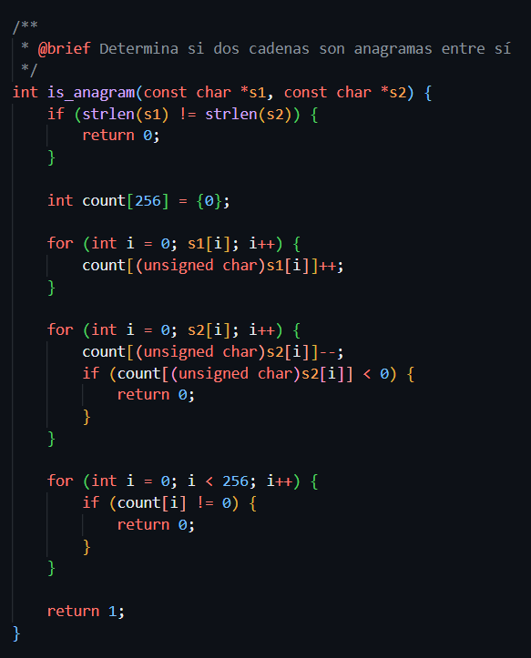
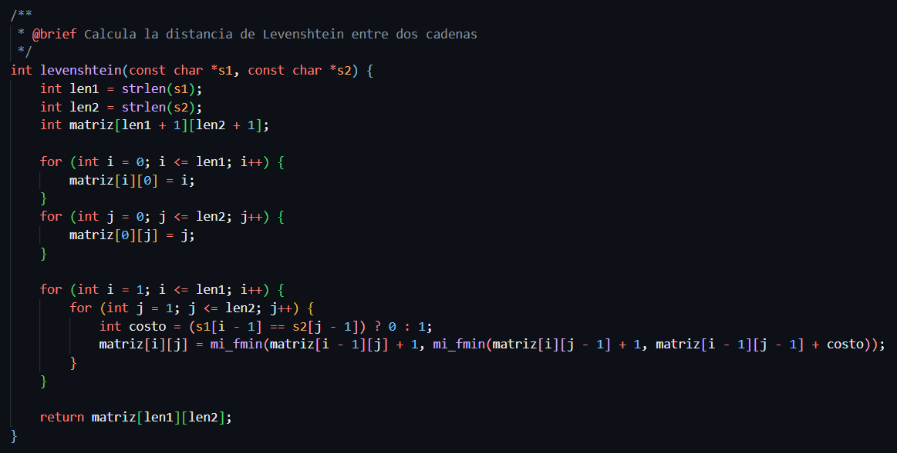
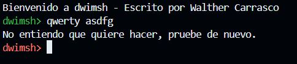
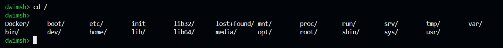

# DWIMSH SHELL

## Funcionamiento

```bash
./dwimsh
```

- DWIMSH es un shell que permite ejecutar comandos de manera interactiva.
- Te recomienda comandos en caso hayas cometido un error en la escritura del comando.
- Te pregunta si quieres ejecutar el comando sugerido, en caso de que no, puedes escribir "n" para no hacerlo, y te recomendará otro comando similar.


## Documentación


### Anagrama

Un anagrama es una palabra o frase que se forma con las mismas letras que otra palabra o frase, pero en diferente orden.
Este algoritmo se implementa para saber si dos comandos son anagramas comparando la frecuencia de sus caracteres. Primero, verifica si las longitudes de ambas cadenas son iguales; si no lo son, retorna 0. Luego, utiliza un arreglo de tamaño 256 (para todos los caracteres ASCII) donde incrementa los valores según los caracteres de la primera cadena y los decrementa con los de la segunda. Si en algún punto un valor es negativo, significa que hay un desbalance y las cadenas no son anagramas. Finalmente, si todos los valores del arreglo son cero, retorna 1, indicando que las cadenas son anagramas; de lo contrario, retorna 0.



### Algoritmo Levenstein

El algoritmo de Levenshtein es una función que calcula la distancia entre dos cadenas de caracteres, este mide la diferencia entre dos cadenas calculando el número mínimo de operaciones necesarias para transformar una en la otra, permitiendo inserciones, eliminaciones y sustituciones de caracteres, este hacer las operaciones necesarias para convertir el comando ingresado en uno válido. Se implementa para calcular la distancia entre el comando escrito y los comandos en 'usr/bin' para sugerir comandos similares.



## Implementaciones

### Comandos Built-in

Los comandos built-in son comandos que se ejecutan directamente por el shell, los implementados son:
- `exit`: Sale del shell.
- `cd`: Cambia el directorio de trabajo.
- `pwd`: Muestra el directorio de trabajo.
- `echo`: Muestra un mensaje en la pantalla.

### Colores en la shell
Se implemente que cada que un comando se ejecuta correctamente, el prompt cambia de color a verde, y cada que un comando falla, el prompt cambia a rojo.


### Librería Readline
Se implemento la librería readline para que el usuario pueda usar el tabulador para autocompletar comandos, y también use el historial de comandos.



## Instalación

### Debian/Ubuntu

```bash
sudo apt-get update
sudo apt-get install libreadline-dev
cd src
make
```

### macOS

```bash
brew install readline
cd src
make
```


### Red Hat/Fedora
```bash
sudo dnf install libreadline-devel
cd src
make
```

### Arch Linux

```bash
sudo pacman -S libreadline
cd src
make
```

