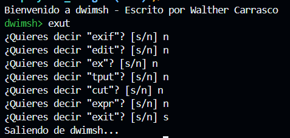

# DWIMSH SHELL

## Instalación

### Debian/Ubuntu

```bash
sudo apt-get update
sudo apt-get install libreadline-dev
cd src
make
```

### macOS

```bash
brew install readline
cd src
make
```


### Red Hat/Fedora
```bash
sudo dnf install libreadline-devel
cd src
make
```

### Arch Linux

```bash
sudo pacman -S libreadline
cd src
make
```

## Funcionamiento

```bash
./dwimsh
```

- DWIMSH es un shell que permite ejecutar comandos de manera interactiva.
- Te recomienda comandos en caso hayas cometido un error en la escritura del comando.
- Te pregunta si quieres ejecutar el comando sugerido, en caso de que no, puedes escribir "n" para no hacerlo, y te recomendará otro comando similar.





## Documentación


### Anagrama

Un anagrama es una palabra o frase que se forma con las mismas letras que otra palabra o frase, pero en diferente orden.
Este algoritmo se imple


### Algoritmo Levenstein

El algoritmo de Levenshtein es una función que calcula la distancia entre dos cadenas de caracteres.

